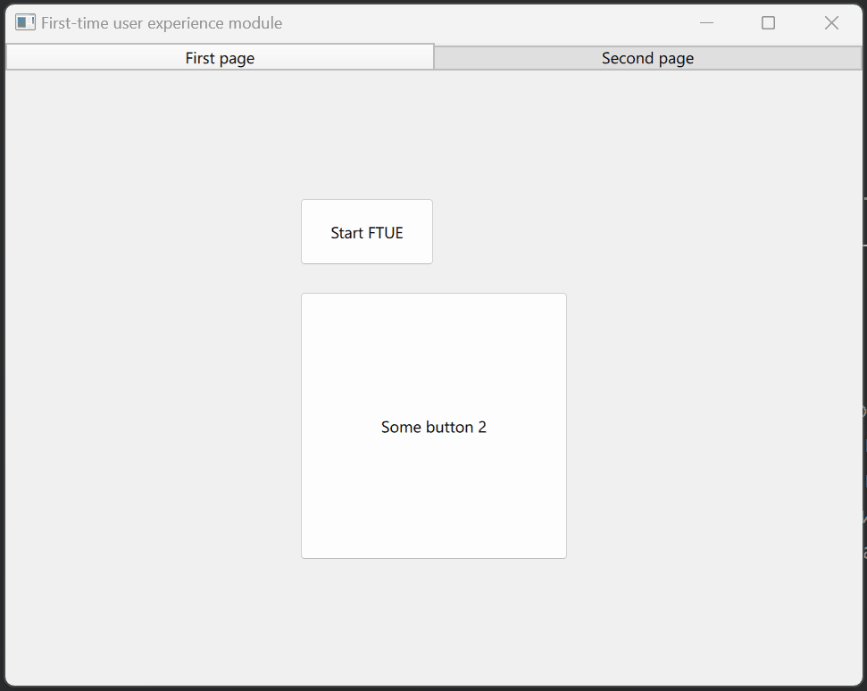

# QML-FTUE-module

## Описание

Пример QML-компонента для [First-time user experience (FTUE)](https://en.wikipedia.org/wiki/First-time_user_experience "FTUE"). Данный модуль предназначен для обучения пользователя 
работе с компонентами приложения.



## Структура проекта

```
FTUE-qml
.
│
└───build
│   │
│   ├──.gitignore
│   └───... (промежуточные файлы/директории сборки)
│
└───doc
│   │
│   └───FTUE-qml.gif
│
└───qml
│   │
│   └───FTUE
│        ├───FTUE.qml
│        ├───FTUEEffect.qml
│        ├───FTUEElement.qml
│        ├───FTUEPanel.qml
│        ├───FTUEWindow.qml
│        └───qmldir
│
├───.gitignore
├───CMakeLists.txt
├───FTUE-qml.pro
├───main.cpp
├───main.qml
├───qtquickcontrols2.conf
├───README.md
└───resources.qrc
```

* FTUE - основной компонент
* FTUEEffect - компонент для применения эффекта затемнения
* FTUEElement - объект для указания элемента, который нужно описать пользователю
* FTUEPanel - панель для переключения компонента или завершения обучения
* FTUEWindow - окно для указания текущего компонента

## Сборка проекта

Проект может быть собран из QtCreator или из папки build командами:

### CMake:

```bash
cmake ..
make
```
> Для debug - "cmake -DCMAKE_BUILD_TYPE=Debug ..", для release - "cmake -DCMAKE_BUILD_TYPE=Release .."

### QMake:

```bash
qmake ..
make
```
> Для debug - "qmake .. CONFIG+=debug", для release - "qmake .. CONFIG+=release"

## Пример использования
Добавление модуля:

```
import FTUE 1.0 as FTUE
```

Использование:
```
FTUE.FTUE {
    id: ftue
    z: 2 // FTUE должен быть выше основной разметки окна/страницы/т.д.

    title: qsTr("Описание ...")

    window: FTUE.FTUEWindow {
        // Переопределение свойств (если требуется)
    }

    panel: FTUE.FTUEPanel {
        // Переопределение свойств (если требуется)
    }

    effect: FTUE.FTUEEffect {
        // Переопределение свойств (если требуется)
    }

    // Список компонентов для обучения пользователя
    model: [
        FTUE.FTUEElement {
            item: "id компонента"
            description: qsTr("Описание ...")
            action: () => {
                // Некоторые действия перед выделением компонента
            }
        },
        // ...
    ]

    onFinish: {
        // Некоторые действия в конце работы FTUE (если требуется)
    }

    onStart: {
        // Некоторые действия в начале работы FTUE (если требуется)
    }
}

```

## Версии

Версии сред, языков и утилит, которые использовались на момент написания проекта.

| Название   | Версия               |
| -----------|----------------------|
| C++        | 20                   |
| Qt Creator | 13.0.2               |
| Qt         | 6.6.3                |
| CMake      | 3.24.2               |
| QMake      | 6.6.3.0              |
| MinGW      | 11.2.0 64 bit        |

Тестировалось на ОС Windows 11 22H2


